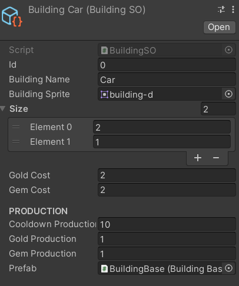
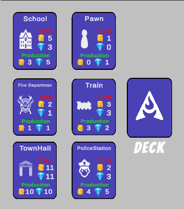

# CARDOPOLIS

A 2D game where we build a city with cards. Build the best city with unlimited cards.

## Customized Card System

 <a href="https://www.w3schools.com/cs/" target="_blank" rel="noreferrer">   
<image src= "./Recording/castle.png" width="200" height="200">
<image src= "./Recording/factory.png" width="200" height="200">
<image src= "./Recording/church.png" width="200" height="200">
  

## Deck System
Unlimited card options. You can produce as many new cards as you want.

 <a href="https://www.w3schools.com/cs/" target="_blank" rel="noreferrer">   
<image src= "./Recording/2.png" width="200" height="200">
  

## Rotate Card System

You can rotate the cards with the "R" key or Mouse Right Cick.

## Save-Load System

You can save the game as you wish and continue where you left off.

<image src= "./Recording/save-load.gif" width="425" height="250">

